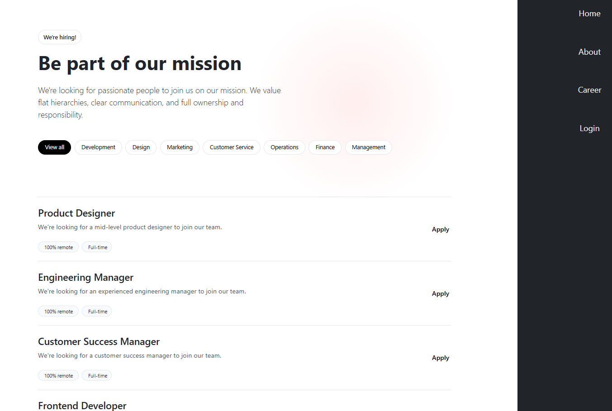
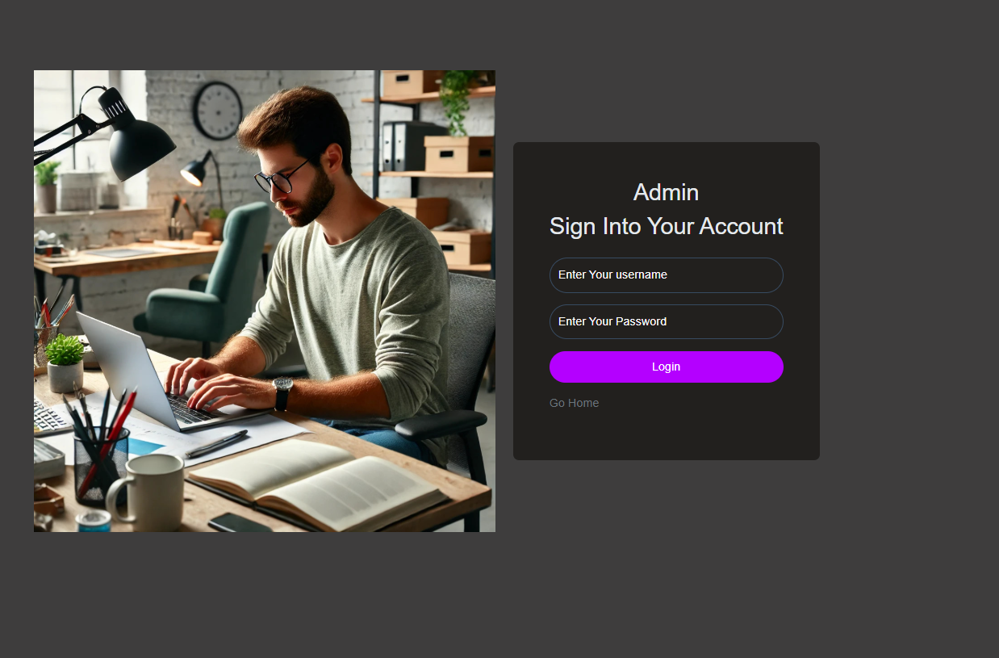
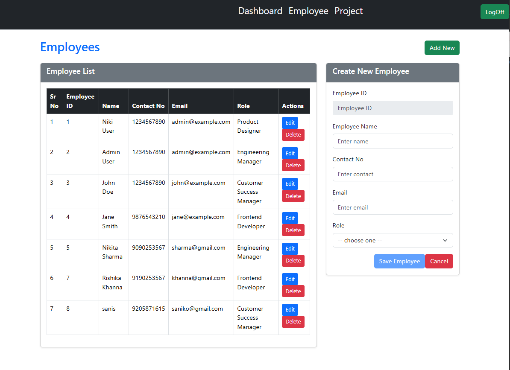
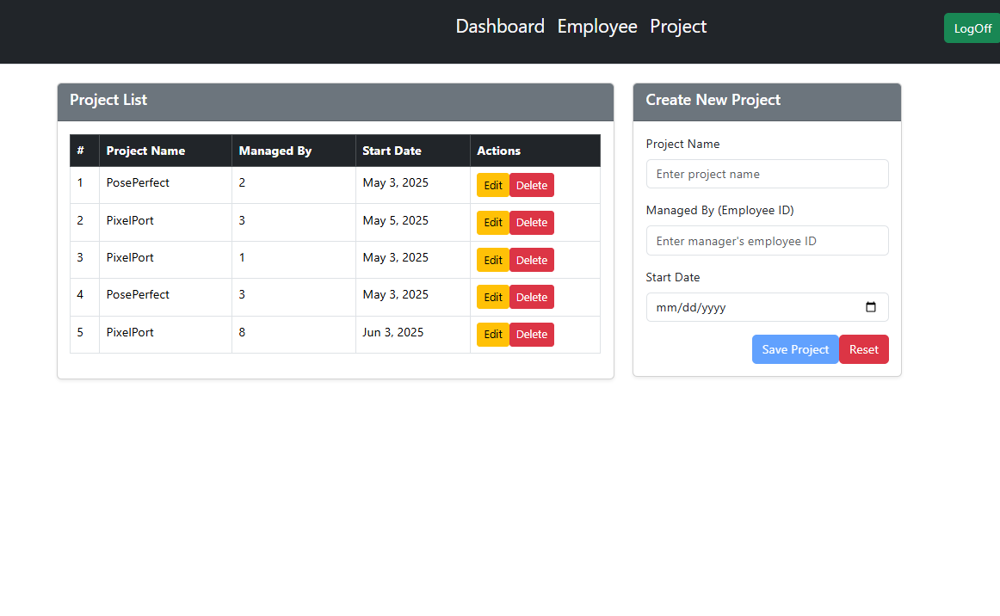

# Web Portal for Admin Management System

An Angular-based application that simplifies administrative operations like department, employee, and project management.

---

## 🚀 Overview

This web portal allows:

- Admins (RME) to manage departments, employees, and project allocations.
- Job applicants to apply via a dedicated **Career Page**.

### Key Modules

- **Career Page** – Public job listings and application form.
- **Admin Dashboard** – Manage employees, departments, and projects.

---

## 🛠️ Tech Stack

- Angular CLI v19.1.7
- TypeScript, HTML, SCSS

---

## ⚙️ Setup

### Prerequisites

- Node.js v16+, npm v8+

### Steps

```bash
git clone https://github.com/<your-username>/<your-repo-name>.git
cd <your-repo-name>
npm install
ng serve
```

Visit [http://localhost:4200](http://localhost:4200)

---

## 🔨 Useful Commands

```bash
ng generate component <name>   # Create new component
ng build                       # Build for production
ng test                        # Run unit tests
ng e2e                         # Run end-to-end tests
```

---

## 🤝 Contribute

Open a pull request or issue for feedback and contributions.

---

## 📚 Resources

- [Angular CLI Docs](https://angular.io/cli)
- [Full Angular Docs](https://angular.io/docs)

## 🖼️ Screenshots

### 🏠 Home Page


### 💼 Career Page



### 🔐 Login Page



### 🧑‍💼 Employee Management




### 📊 Project Management

